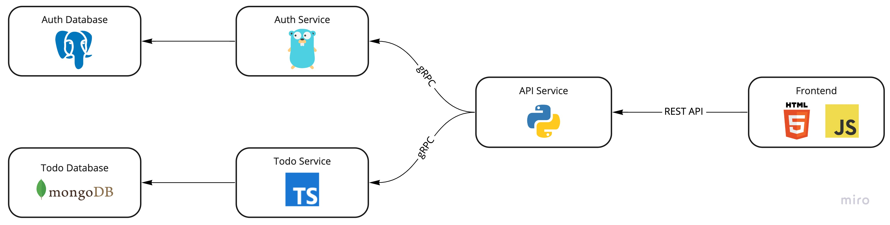
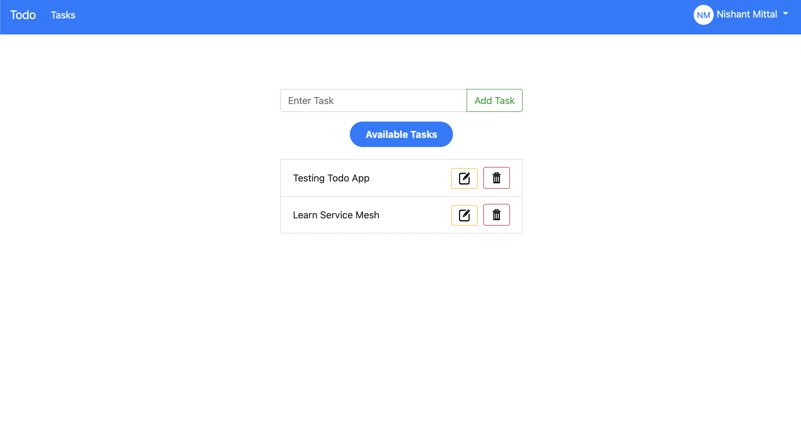
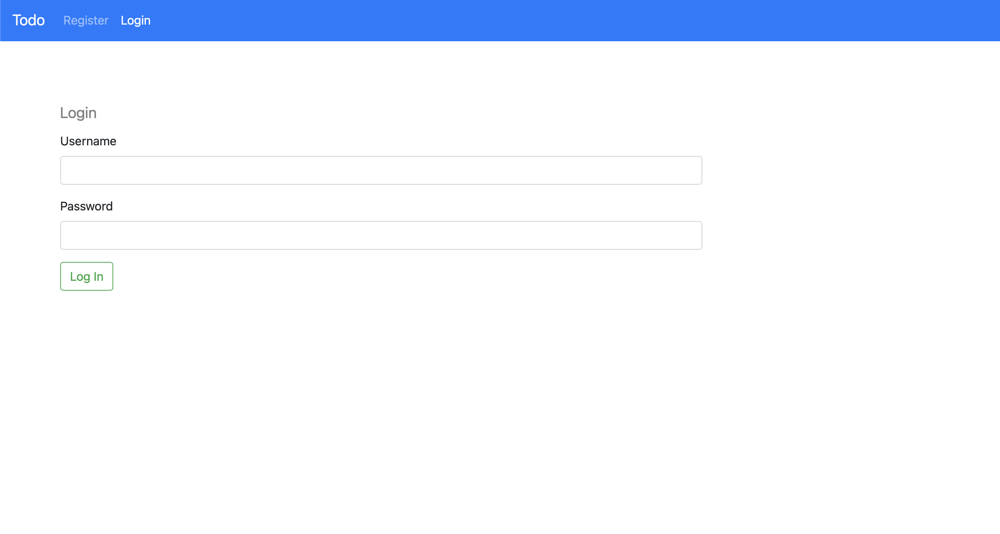
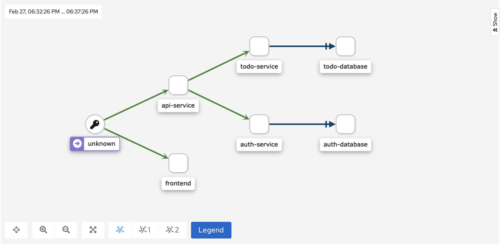

## microservices-example
This is a todo app based on microservice architecture. I made this project while learning about Docker, Kubernetes, gRPC, Service Meshes.

## Architecture
Here is an overview of the application architecture.

| Service | Language, Framework | Description |
| --- | --- | --- |
| [frontend](./frontend/) | HTML, CSS, JavaScript | This is a simple web app written in plain HTML, CSS, JavaScript. It's docker image uses `apache httpd` to serve the web app. |
| [api-service](./api-service/) | Python, FastAPI | This service exposes RESTful APIs that the `frontend` communicates with. It doesn't have much business logic but instead further communicates with `auth-service` and `todo-service` over `gRPC` to handle the requests. The protobuf definitions can be found [here](./protobuf/). |
| [auth-service](./auth-service/) | Go | This service handles all the authentication, registration, etc. logic. It stores all its data in a `PostgreSQL` database. |
| [todo-service](./todo-service/) | TypeScript | This service basically handles all the CRUD operations of todos. It stores all its data in a `MongoDB` database. |

## Running the app
### Building Docker Images
To run this app first you'll need to build the docker images for all the services.

#### frontend
- `cd frontend`
- `docker build -t todo-app-frontend:v1 .`

#### auth-service
- `cd auth-service`
- `docker build -t todo-app-auth-service:v1 .`

#### todo-service
- `cd todo-service`
- `docker build -t todo-app-todo-service:v1 .`

#### api-service
- `cd api-service`
- `docker build -t todo-app-api-service:v1 .`

### Deploying on kubernetes cluster
Now, you can deploy the app on your kubernetes cluster.

#### Create a namespace called todo-app
- `kubectl create ns todo-app`

#### Apply the manifests
- `kubectl apply -f kubernetes/`

## Screenshots
### Todo App

| Home Page | Login Page |
| --- | --- |
|  |  |

### Services Graph by Kiali in Istio Service Mesh

## Footnote
Here are some other larger sample projects based on microservice architecture that you should check out.

- [Online Boutique](https://github.com/GoogleCloudPlatform/microservices-demo#architecture) by Google
- [Bookinfo Application](https://istio.io/latest/docs/examples/bookinfo/) by Istio
